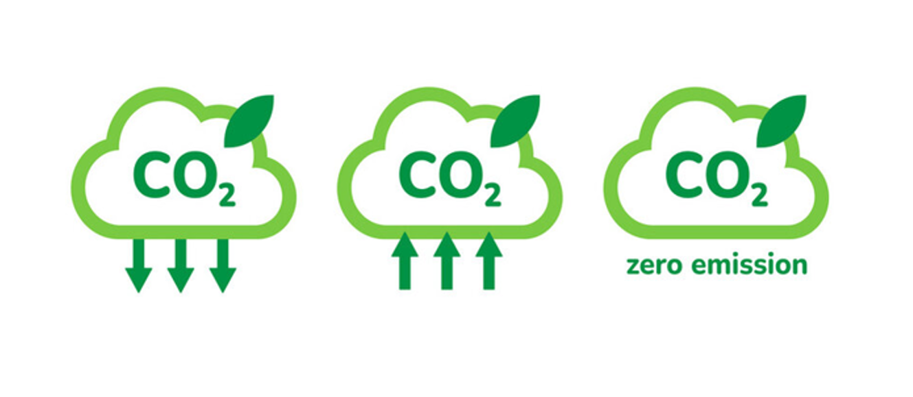
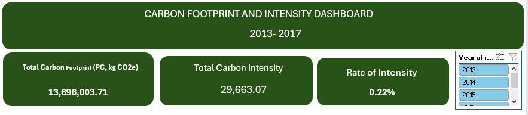
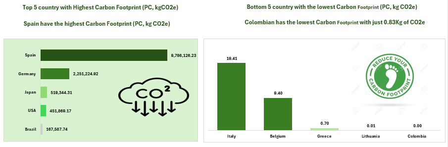
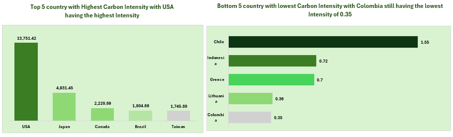
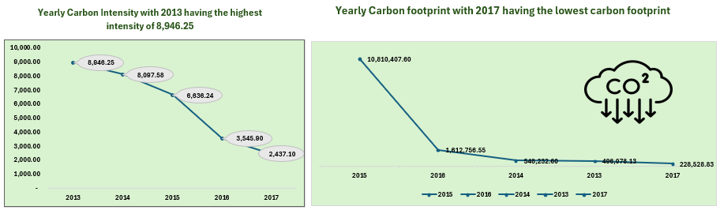
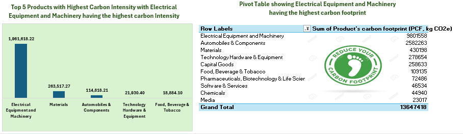

# Analyzing-Carbon-Footprint-and-Reporting-A-journey-to-Carbon-Neutrality

___
## Introduction
The release of harmful gases into the environment undoubtedly has adverse effects on human health. Among the primary contributors to the heightened emission of these toxic gases into the atmosphere are the industrial activities conducted by companies globally. 
This project seeks to evaluate advancements and uncover patterns that can optimize efficiency on the path to achieving carbon neutrality by the early 2050s.
Carbon neutrality, often referred to as net-zero carbon emissions, stands as a pivotal ambition in the global fight against climate change. In essence, it signifies a balance between the amount of greenhouse gases released into the atmosphere and the quantity that is removed, resulting in a net-zero carbon footprint.

## Background of the project 
In this project, I use Microsoft excel to analyze 866 commercial products carbon footprints (PCFs) across 30 industries from 28 countries to drive insights to answer pertinent questions of SDGs goals to reduce emissions by 45-50% by 2030 and achieve net zero - globally - in the early 2050s.

**_Disclaimer_** : _The dataset was downloaded raw from nature.com website as an excel file. Nature.com stores product carbon footprints (PCFs) for various companies. PCFs are the greenhouse gas emissions attributed to a given product, measured in CO2e (carbon dioxide equivalent). The data is from 2013 to 2017_.

## About The Data

Data tables encompassing information on gas emissions across different years, product lifecycles, corporate emissions, and the carbon footprint of products from 28 countries were gathered and systematically analyzed. The dataset's comprehensive details proved instrumental in achieving the project's objectives.

## Tool used: 

Microsoft Excel was used for the entire analytical process.

## Data Cleaning and Transformation
This stage was executed using Microsoft's Power Query editor. The dataset exhibited certain issues such as the presence of null values, Duplicates, inconsistent column naming conventions, values requiring conversion, and incorrect data types. No duplicates or outliers were identified during this process.

___
## Ready for analysis

This is data that has undergone various steps of cleaning to ensure accuracy, consistency, and is ready for analysis.

___
## Problem of statement:
1.  Which country has the highest Carbon Footprint (PC, kg CO2e)
2.  Which bottom 5 country has the lowest Carbon Footprint (PC, kg CO2e)
3.  Which top 5 Products has the highest Carbon Emission.
4.  Bottom 5 Product with low Carbon Emission.
5.  Yearly Carbon Intensity.
6.  Top 5 Products with Highest Carbon Intensity
   
## Skills Demonstrated.

- Filter
- Text Box
- Pivot table capabilities.
- CO2e Icons
- Color theme.

## Visualizations: 

### The visualization comprises of 11 tables.

- Total Carbon Footprint (PC, kg CO2e)
- Total Carbon Intensity
- Rate of Intensity
- Top 5 with Highest Carbon Footprint (PC, kg CO2e)
- Bottom 5 country with the lowest Carbon Footprint (PC, kg CO2e)
- Top 5 Products with Highest Carbon Emission.
- 5 Product with low Carbon Emission.
- Yearly Carbon Intensity.
- Top 5 Products with Highest Carbon Intensity
- Pivot table.
- CO2e Icons

As showing below:

You can interact with the report [here](https://ihvnigeria-my.sharepoint.com/:x:/g/personal/imichael_ihvnigeria_org/EYgCxk0L2IZCmtvK34yi4B8BBsBDiCv7n5DZ1nfxzTZKmg?e=RQNwsr)

## Analysis

**_Top 5 countries with the highest and lowest Carbon Footprint (PC, kgCO2e)_**

---

The visual on the left shows the top 5 countries with the highest Carbon footprint (PC, kgCO2e). From the analysis it shows that with Spain have the highest carbon footprint of 9,788,126.23 kg (about 21579098.85 lb. (about 9788106.61 kg).) CO2e while the second visual to the right is the bottom 5 countries with the lowest Carbon footprint (PC, kgCO2e) It shows that Colombia has the lowest carbon footprint (PC, kgCO2e).

**_Top 5 countries with the highest and lowest Carbon Intensity_**

The chart on the left-hand side shows the top 5 countries with the highest Carbon Intensity. From the chart you can see that the USA ranks highest in terms of carbon intensity of about 13,751.42. Also, the chart to the right shows Bottom 5 countries with the lowest Carbon intensity with Colombian still ranking lowest with 0.35.

**_Top 5 Products with Highest Carbon Emission_**

---

From the above infographic, we could see that Equipment and Machinery emitted the highest carbon to the atmosphere while Household & Personal Products had the lowest carbon footprint.

**_Yearly Carbon footprint and Yearly Carbon Intensity_** 

---

From the visual to the left, we could see that carbon intensity was at its peak in the year 2013 and at its lowest in the year 2017. On the visual to the right, we can deduce that carbon footprint was on the rampage in the year 2015 and has it lowest emission in the year 2017.

**_Top 5 Products with Highest Carbon Intensity with Electrical Equipment and Machinery having the highest carbon Intensity._**

---

The chart to the left shows that Electrical Equipment and Machinery has the highest carbon intensity while food, beverages and tobacco had the lowest carbon intensity.

# Conclusion and recommendations

## Conclusion: 

In conclusion, the analysis reveals significant insights into global carbon footprints and intensities. Spain emerges as the country with the highest carbon footprint, indicating a need for targeted sustainability measures. The USA leads in carbon intensity, demanding attention to industry-specific emissions. Equipment and Machinery contribute substantially to carbon emissions, emphasizing the imperative for greener technologies. Notably, carbon intensity peaked in 2013, urging a focus on historical trends for informed decision-making. The year 2017 witnessed the lowest carbon footprint, underscoring potential success in emission reduction strategies. Examining industry-specific data, Electrical Equipment and Machinery stand out with the highest carbon intensity, emphasizing the sector's environmental impact. These findings underscore the importance of strategic interventions for carbon reduction on both national and industrial scales.

# Recommendations: 

Based on the analysis, recommendations include implementing targeted policies in Spain to curb carbon emissions and encouraging sustainable practices. The USA should prioritize industry-specific strategies to address its high carbon intensity. Industries involved in Equipment and Machinery should adopt eco-friendly technologies to reduce their carbon footprint. Historical analysis suggests the need for periodic assessments to identify effective intervention points. Continued efforts to replicate the success of 2017 in reducing carbon footprints globally are essential. Industries, especially Electrical Equipment and Machinery, should explore eco-friendly alternatives to mitigate carbon intensity. Overall, a holistic approach, incorporating both national and industrial perspectives, is crucial for achieving sustainable carbon reduction goals.

---
