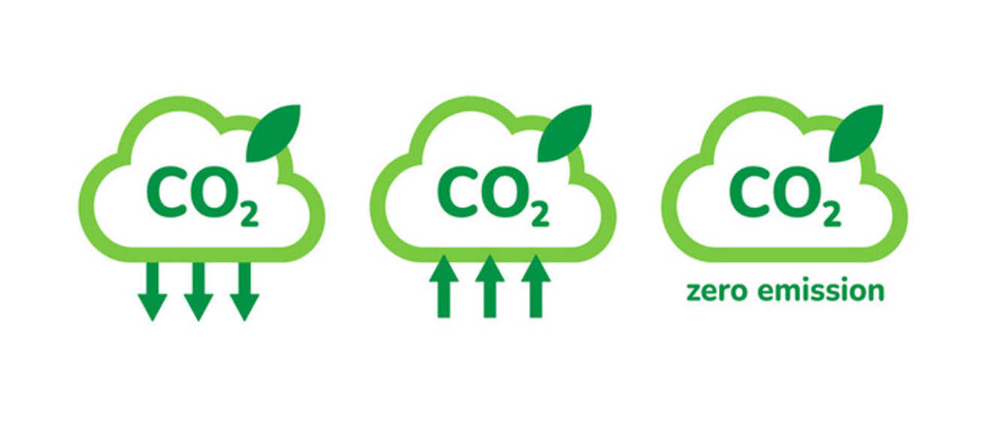
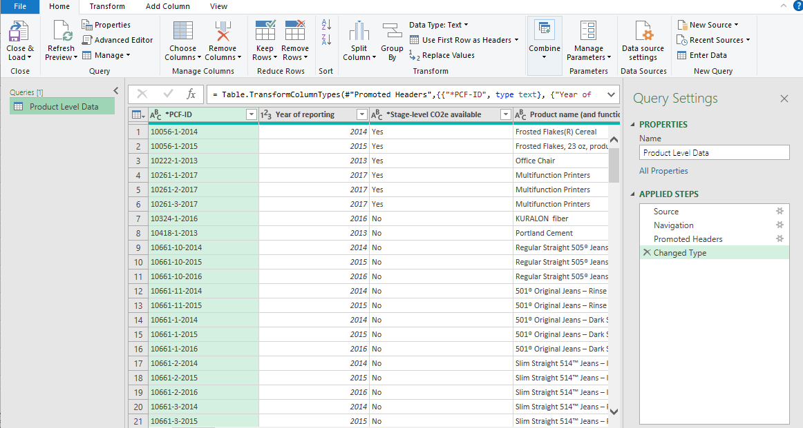
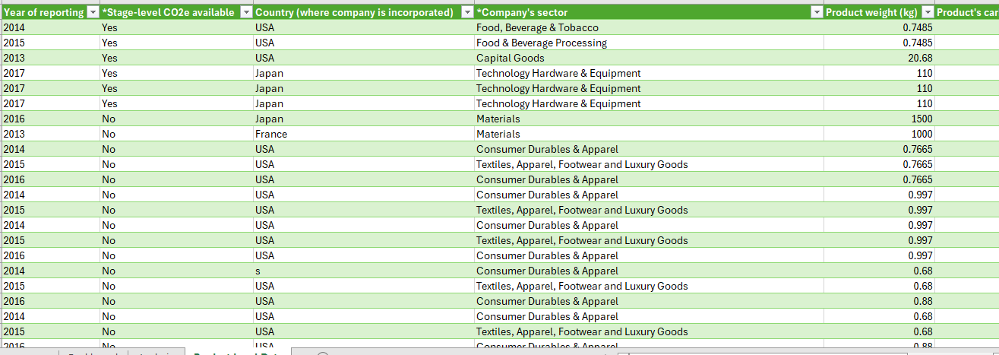
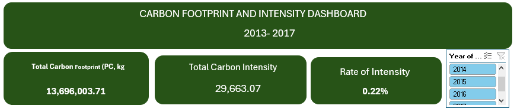
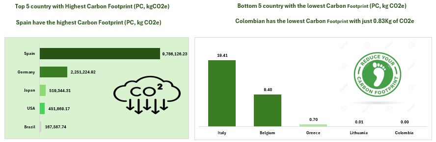
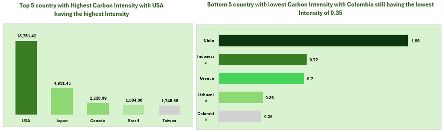
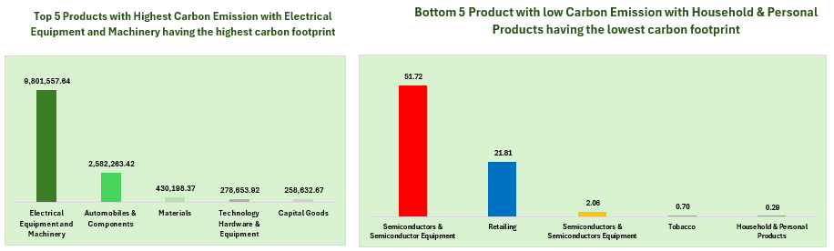
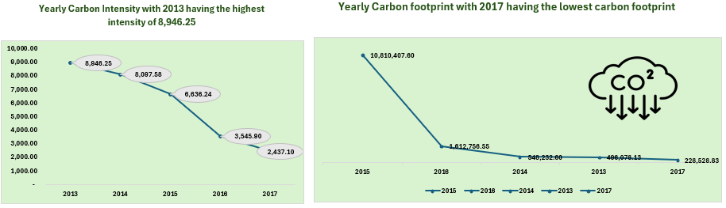
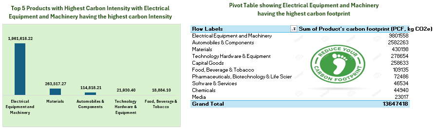

# Analyzing-Carbon-Footprint-and-Reporting-A-journey-to-Carbon-Neutrality

___
## Introduction
The release of harmful gases into the environment undoubtedly has adverse effects on human health. Among the primary contributors to the heightened emission of these toxic gases into the atmosphere are the industrial activities conducted by companies globally. 
This project seeks to evaluate advancements and uncover patterns that can optimize efficiency on the path to achieving carbon neutrality by the early 2050s.
Carbon neutrality, often referred to as net-zero carbon emissions, stands as a pivotal ambition in the global fight against climate change. In essence, it signifies a balance between the amount of greenhouse gases released into the atmosphere and the quantity that is removed, resulting in a net-zero carbon footprint.

## Background of the project 
In this project, I use Microsoft excel to analyze 866 commercial products carbon footprints (PCFs) across 30 industries from 28 countries to drive insights to answer pertinent questions of SDGs goals to reduce emissions by 45-50% by 2030 and achieve net zero - globally - in the early 2050s.

**_Disclaimer_** : _The dataset was downloaded raw from nature.com website as an excel file. Nature.com stores product carbon footprints (PCFs) for various companies. PCFs are the greenhouse gas emissions attributed to a given product, measured in CO2e (carbon dioxide equivalent). The data is from 2013 to 2017_.

## About The Data

Data tables encompassing information on gas emissions across different years, product lifecycles, corporate emissions, and the carbon footprint of products from 28 countries were gathered and systematically analyzed. The dataset's comprehensive details proved instrumental in achieving the project's objectives.

## Tool used: 

Microsoft Excel was used for the entire analytical process.

## Data Cleaning and Transformation
This stage was executed using Microsoft's Power Query editor. The dataset exhibited certain issues such as the presence of null values, Duplicates, inconsistent column naming conventions, values requiring conversion, and incorrect data types. No duplicates or outliers were identified during this process.

___
## Ready for analysis

This is data that has undergone various steps of cleaning to ensure accuracy, consistency, and is ready for analysis.

___
## Problem of statement:
1.  Which country has the highest Carbon Footprint (PC, kg CO2e)
2.  Which bottom 5 country has the lowest Carbon Footprint (PC, kg CO2e)
3.  Which top 5 Products has the highest Carbon Emission.
4.  Bottom 5 Product with low Carbon Emission.
5.  Yearly Carbon Intensity.
6.  Top 5 Products with Highest Carbon Intensity
   
## Skills Demonstrated.

- Filter
- Text Box
- Pivot table capabilities.
- CO2e Icons
- Color theme.

## Visualizations: 

### The visualization comprises of 11 tables.

- Total Carbon Footprint (PC, kg CO2e)
- Total Carbon Intensity
- Rate of Intensity
- Top 5 with Highest Carbon Footprint (PC, kg CO2e)
- Bottom 5 country with the lowest Carbon Footprint (PC, kg CO2e)
- Top 5 Products with Highest Carbon Emission.
- 5 Product with low Carbon Emission.
- Yearly Carbon Intensity.
- Top 5 Products with Highest Carbon Intensity
- Pivot table.
- CO2e Icons

As showing below:

You can interact with the report [here](https://ihvnigeria-my.sharepoint.com/:x:/g/personal/imichael_ihvnigeria_org/EYgCxk0L2IZCmtvK34yi4B8BBsBDiCv7n5DZ1nfxzTZKmg?e=RQNwsr)

## Analysis

**_Top 5 countries with the highest and lowest Carbon Footprint (PC, kgCO2e)_**

